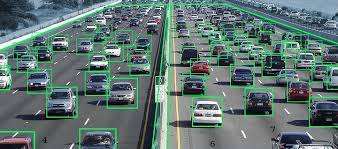
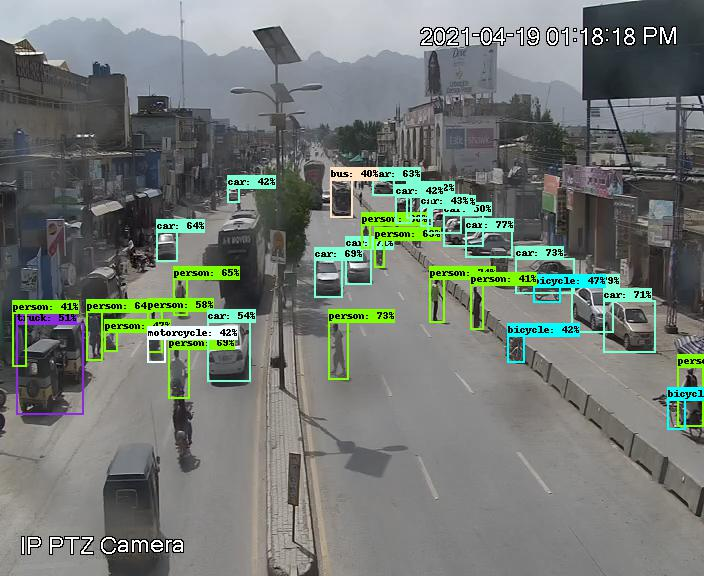

# Welcome Smart Traffic Project

## Introduction

This project utilizes a deep learning method to detect and count objects such as cars, humans, and bikes in real-time. Python is the primary programming language used, along with the following libraries: 

```
Flask, numpy, flask-socketio, eventlet, gunicorn, opencv-python, aiosqlite, databases
```

## Run Project

First install the requirements by running this command.
```bash
pip install -r requirements
```
```bash 
python3 app.py
```

## Results


